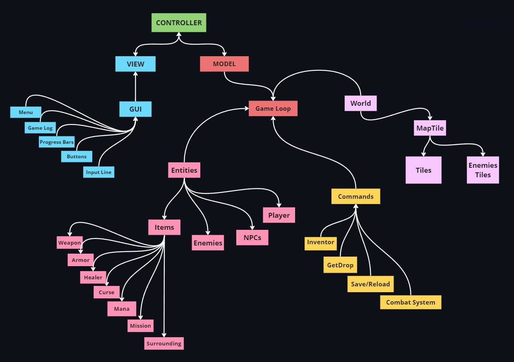

# PyIntruder

## How to Install

1. Create a virtual environment with Python 3.11.
2. Install requirements (or just install PyQt6):

        pip install -r requirements.txt
        # or
        pip install PyQt6

3. Run the game:

        python launcher.py

## How to Play

You can move around the map and interact with game world by entering commands into the text input line or pressing buttons.
To move to an adjacent room, simply enter one of the four cardinal points (**N**, **S**, **W**, **E**) or move by GUI arrows.

You can see the world map by typing the (**M**) command (it will be shown in the terminal *for now*).

When player enters a room where there is a living enemy, they will automatically be attacked and can respond with a physical attack (**A**) by using a weapon or by casting a curse (**C**).
Weapon attacks can miss, while curses cannot but each curse cast consumes a varying amount of Mana.

You shall pay attention to your amount of **HP** (**Health Points**) and **MANA**: if **HP** parameter reaches 0, the game is over. If your **MANA** reaches zero, you will no longer be able to cast curses.
With the appropriate command you can consume an item to heal (**HEAL**) yourself or to restore mana (not yet implemented): while wandering around the map, you may find a lot of useful stuff around you if you take a good look around. You can pick up items from the environment or drop them from your inventory.

If there is an NPC in the room, their presence is signaled and it is possible to talk to them with talk command (**Talk**). If NPC is willing to trade, they announces it and you can choose to Buy, Sell or Quit.

You can save the current game and reload from file entering commands or selecting voices from the menu bar.

## Game Commands

The recognized commands are case insensitive:

- **NORTH**, **SOUTH**, **WEST**, **EAST** - Move to one of the adjacent rooms, if any.
- **ATTACK** - Attack an enemy with a weapon.
- **CURSE** - Cast a curse on an enemy.
- **DIAGNOSE** - Show informations about the game and the player.
- **DROP FROM LIST** - Show inventory to choose what to drop.
- **DROP ITEM** - Drop an inventory item in the current room.
- **GET ITEM** - Get the specified item from the current room.
- **GET FROM LIST** - Display a list of items to collect from the room.
- **HEAL** - Select an item from inventory to restore HP.
- **INVENTORY** - Show items in Player's inventory
- **LOOK** - Show a description of the current room and tells what items, enemies, or NPCs are in it.
- **LOOK AT** - Show a detailed description of a specified object.
- **MAP** - Show world map.
- **OPEN OBJECT** - Open the indicated object if it is openable.
- **QUIT** - Exit the game.
- **RELOAD** - Reload saved game from a .pkl file.
- **RUN** - Try to run away from a fight.
- **SAVE** - Save current game state on a .pkl file.
- **TALK TO** - Talk with a NPC.
- **TRADE** - Trade with a NPC.

## Changelog

- [x]: Added MVC architecture to play via PyQt6 GUI instead of using CLI.
- [x]: Added a system of signals and slots to connect model, view and controller.
- [x]: Added a new way to handle game loop using QThread to process user input received from View without breaking it.
- [x]: Updated the signal strings parsing system by implementing **regular expressions**, now commands are in a separate class.
- [x]: Updated Entities creation organization with a better use of **OOP**.
- [x]: A complete refactoring of player.py code was made, which had too long methods in the first version of the project.
- [x]: Extracted large methods and added an utilities module to handle game mechanics.
- [x]: Improved GUI with action buttons and a menu bar using OOP composition.
- [x]: Updated QWidgets style using [QSS](https://doc.qt.io/qtforpython-6/overviews/stylesheet-examples.html).
- [x]: Now text has a color scheme to highlight character names and commands using inline CSS and decorators.
- [x]: Add new utils module to improve composition: original Player class was way too large and now methods related to inventory manipulation, actions and combat system have been moved into separate modules.
- [x]: Added save and reload functionalities. They were also present in the original version of the game but the code needed to be adapted to all the changes made since then.
- [ ]: Add the possibility to start a new game.
- [ ]: Add Mana recharging functionality.
- [ ]: Implement dialogues with NPCs.
- [ ]: Add game events.
- [ ]: Show the world map, which is probably too large to be contained in a signal as a string. Maybe I'll try creating a widget for it.
- [ ]: Improve algorithms used to calculate item stats so that gameplay is as balanced as possible.

Here's a scheme of the game structure so far:

## Notes

**This game is not complete**. Many room types and enemies that I plan to include in the game world, game events and dialogues with NPCs have not been implemented yet, plus the current game map is tiny: I used it for development purposes only and is not intended to be the final map. The final game map could be something like this:

    |  |  |  |  |  |  |  |RV|IN|  |  |  |  |  |  |
    |  |  |  |  |  |  |  |RV|  |  |  |Lo|  |  |  |
    |OK|.2|..|.2|..|.3|  |RV|  |.3|..|.3|..|.3|  |
    |  |.2|  |.1|  |..|  |RV|  |..|  |  |  |.3|  |
    |  |.1|  |..|  |.3|  |RV|  |.4|  |  |  |..|  |
    |  |.2|  |..|  |.2|  |RV|  |..|  |  |  |.4|  |
    |  |..|  |BS|  |..|  |RV|  |.3|  |  |  |..|  |
    |  |.2|  |  |  |.3|.4|..|.3|.4|  |  |  |.3|  |
    |  |..|  |  |  |  |  |RV|  |  |  |..|  |..|  |
    |  |.1|  |  |  |  |  |RV|  |  |  |.4|  |.4|  |
    |  |.2|  |  |.1|.1|  |RV|  |  |  |..|  |.4|  |
    |  |.1|..|..|.1|.1|  |RV|  |.5|..|..|.5|.4|  |
    |  |  |.2|Lo|  |..|  |RV|  |..|  |Lo|  |  |  |
    |  |  |.1|  |  |.1|  |RV|  |.5|  |  |  |  |  |
    |  |.1|.2|  |FT|..|  |RV|..|..|  |  |  |  |  |
    |  |  |.1|  |  |.2|  |RV|  |.5|  |.5|  |  |  |
    |SS|..|.1|..|..|.1|  |RV|  |..|..|..|.5|.5|WW|
    |  |  |.1|  |  |.1|  |RV|  |  |  |  |  |  |  |

I really like [that shape](https://en.wikipedia.org/wiki/Hilbert_curve). If you want to try it you can copy and paste it in place of the one defined in *world.parser* module as **world_dsl**. Furthermore, game is missing a lot of GUI features because I'm still developing them.
This game does not require the installation of any other library besides PyQt6 and the code is currently compatible with Python 3.11.

## Known Issues

On Linux (in my case on Ubuntu 20.04.6 LTS) you will probably encounter this issue:

    qt.qpa.plugin: Could not load the Qt platform plugin "xcb" in "" even though it was found.
    This application failed to start because no Qt platform plugin could be initialized. Reinstalling the application may fix this problem.
    Available platform plugins are: xcb, linuxfb, offscreen, eglfs, vkkhrdisplay, wayland, wayland-egl, minimal, vnc, minimalegl."

To solve it, try to run this command:

    sudo apt-get install '^libxcb.*-dev' libx11-xcb-dev libglu1-mesa-dev libxrender-dev libxi-dev libxkbcommon-dev libxkbcommon-x11-dev
